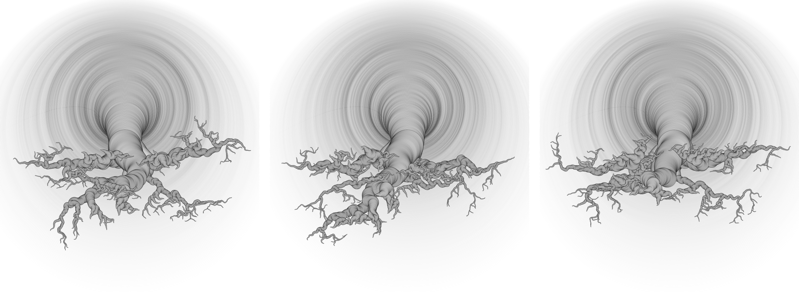

# Roquentin's tree

> *"If you existed, you had to exist to that extent, to the point of mildew, blisters, obscenity. In another world, circles and melodies kept their pure and rigid lines. [...] But a circle doesn’t exist either. That root, on the other hand, existed in so far that I could not explain it. Knotty, inert, nameless, it fascinated me, filled my eyes, repeatedly brought me back to its own existence. It was no use my repeating: ‘It is a root’ – that didn’t work any more. I saw clearly that you could not pass from its function as a root, as a suction-pump, to that, to that hard, compact sea-lion skin, to that oily, horny, stubborn look. The function explained nothing; it enabled you to understand in general what a root was, but not that one at all. That root, with its colour, its shape, its frozen movement, was … beneath all explanation."*

\- J. P. Sartre

This work presents a generative system producing images of a tree/root, and is conceived as a part of a book cover of J. P. Sartre's novel Nausea, where each book could have a slightly different cover due to variances in each output. The work is inspired by a climax scene from the book, where the main character Antoine Roquentin, increasingly lost in significance, and overcome by randomness, loses his grip on perception of a tree in front of him, which he perceives as thoroughly detached from it's signifier, but at the same time able to take on a completely random connotation. 



**Deployed at:** https://bierdous.github.io/nausea_cover/

## Used technology
p5.js, circles drawn on a flow field

## Code snippet

This function determines the direction, in which the individual roots grow.
```
update() {
    let noiseScale = 0.1;
    let noiseoff = noise(this.x * noiseScale,
      this.y * noiseScale,
      this.noiseZ * noiseScale);
    this.noisea = TAU * noiseoff - this.angle;
    let segmSizeOffs;
    segmSizeOffs = -this.startSize/this.len;
    this.x += cos(this.noisea);
    this.y += sin(this.noisea);
    this.segmentSizeX += segmSizeOffs;
    this.segmentSizeY += segmSizeOffs;
  }
}
```